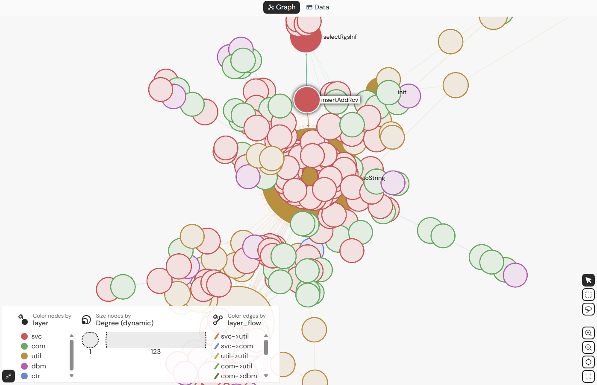

<p align="center">
  <a href="README.en.md"></a>
  <a href="README.md"></a>
</p>

<p align="center">
  
</p>

<p align="center">
  <strong>Excavate legacy code, map architecture, and deliver insights.</strong><br>
  Retrospec Agent is a local daemon-backed toolkit that helps OpenCode agents route static analysis, AI analysis, and export work safely for legacy codebases.
</p>

<p align="center">
  <a href="#what-it-does">What it does</a> ·
  <a href="#agent-roles">Agent roles</a> ·
  <a href="#supported-languages-and-analysis-model">Supported languages and analysis model</a> ·
  <a href="#quickstart">Quickstart</a> ·
  <a href="#how-it-works">How it works</a> ·
  <a href="#result-access-and-integrations">Result access and integrations</a> ·
  <a href="#troubleshooting">Troubleshooting</a>
</p>

## What it does

Retrospec does not pretend to understand a legacy codebase all at once. It first uses a local daemon to track project state, then lets OpenCode agents check that state before routing analysis work through controlled boundaries.

The core model is **daemon-first, evidence-first**. Agents do not guess from source alone. They read static analysis DBs, AI analysis DBs, glossary state, and graph exports so every step leaves evidence behind. When the built-in skills are not enough, Retrospec clarifies the user's requirement through an interview and only runs source-fit analysis scripts after they pass the validation loop.

The current public release is built for **OpenCode workflows**. The CLI daemon and dashboard run locally, while agent routing, skill loading, hook/config policy, and `.opencode/retrospec.jsonc` are documented for OpenCode.

## Agent roles

The current agent setup follows the OpenCode agent/subagent workflow. These are the main roles shown in the validation-loop diagram below.


| Agent | Role |
|---|---|
| `retrospec` | Primary status router and guide |
| `retro` | Static analysis planning and management |
| `spec` | AI analysis over source and retro outputs |
| `Surveyor` | Source structure and language reconnaissance |
| `Curator` | Analysis DB, glossary, and entity registry checks |
| `Excavator` | Approved generated job execution through the daemon |
| `Appraiser` | Generated script, manifest, and evidence review |
| `Archivist` | CSV/XLSX exports and glossary import/reconciliation |

See [`skills/README.md`](skills/README.md) for the skill routing and readiness contract.

## Supported languages and analysis model

```text
Recommended/supported: OpenCode + retrospec-agent
Runtime: Bun >= 1.3.0
```

Analysis agents start from the language rules and parser strategies bundled in the skills. Priority languages such as Java, C, and TypeScript use parser/AST-backed extraction where possible. Other languages, or incomplete parser coverage, are marked with `best-effort`, `unsupported`, and `missing_capability` evidence instead of pretending to be exact.

When a request does not fit the default rules, Retrospec does not silently invent an analyzer. It interviews the user to define the extraction target, conditions, and success criteria, then creates an analysis script through this loop.


The loop keeps these boundaries:

- Surveyor checks source shape and language traits first
- custom-analysis-interview narrows target, conditions, and success criteria
- source-fit generated analyzer writes a manifest and generation contract
- validation report checks sandbox, dry-run, sample coverage, and parser fallback
- only Appraiser-approved jobs are submitted by Excavator to the daemon
- reduced coverage is preserved as `evidence_label`, `support_level`, and `missing_capability`

## Key features

- Per-project `.retrospec/` state directory management
- structure, symbols, SQL, call graph, dependency, data flow, complexity, and security candidate handoff
- spec/risk/migration/summary AI analysis preparation
- custom analysis interview and generated script validation loop
- CSV/XLSX exports, GraphML/Cypher/Mermaid graph exports, and glossary upload staging
- dashboard views for daemon health, projects, jobs, analysis DBs, and exports
- GraphML/Cypher/Mermaid previews in the exports dashboard
- read-only `/mcp` JSON-RPC surface for legacy and 2026 stateless-style MCP clients
- Appraiser/Excavator gate before any generated analysis program is executed

Retrospec's default rule is **status first, daemon first**. Agents check daemon health and `/analysis/status` before recommending or running the next step.

## Quickstart

### 1. Install

```bash
npm install -g retrospec-agent
```

Requirements:

```text
OpenCode
Bun >= 1.3.0
```

Before launching OpenCode for a project, add the Retrospec agents to that project's OpenCode config.

```bash
cd /path/to/your/project
retrospec install .
```

On the first setup, Retrospec asks which model setup to use. The chosen Retrospec agent models are saved under `retrospec.agent_models` in the global OpenCode config, so running `retrospec install .` in another project writes the same model values into that project's `.opencode/opencode.jsonc`.

To change the model setup later, rerun the selection flow from the target project.

```bash
retrospec install . --select-model
```

OpenCode provider/API key/model catalog settings still belong in the global OpenCode config (`~/.config/opencode/opencode.json` or `OPENCODE_CONFIG_DIR/opencode.json`). Retrospec only reads provider names from there and writes concrete agent model values into the project `.opencode/opencode.jsonc`.

You can also ask an OpenCode agent to do the setup:

```text
Run retrospec install . for this project first so the Retrospec agents are added, then verify status and the dashboard URL for the current project.
```

For agent-driven setup and daemon recovery, point the agent to [`docs/agent-install.en.md`](docs/agent-install.en.md).

### 2. Start from the project

Start the Retrospec daemon in the background first.

#### Windows

On Windows, the current `retrospec status .` auto-started daemon can exit as soon as the parent process exits. We recommend starting the daemon first, then checking status from the target project.

```cmd
# Start daemon
retrospec daemon

# Start daemon in the background
start /B retrospec daemon
```

#### macOS/Linux

On macOS/Linux, `retrospec status .` starts the daemon automatically when no daemon is running, so you can usually skip this step. You can also start it directly with `retrospec daemon`.

Then check status from the project you want to analyze.

```bash
cd /path/to/your/project
retrospec status .
```

`retrospec status .` tries to start a daemon when no usable daemon exists or when the existing daemon does not match the current CLI version. If an old daemon is recorded for another workspace, Retrospec shuts down that endpoint with the current runtime token and makes the new daemon current.

After the status check, launch OpenCode and confirm that the Retrospec agents are available.

### Upgrade caution

After updating the npm package, run `retrospec status .` from the target project again. Retrospec cleans up the recorded daemon endpoint when it is stale, unreachable, or from an older version, then starts a current daemon.

```bash
cd /path/to/your/project
retrospec status .
```

### 3. Open the dashboard

Open the dashboard URL printed by `retrospec status .`. The dashboard URL uses the `/dashboard` path, not just the daemon base URL.

```text
http://127.0.0.1:<port>/dashboard
```


## How it works


Retrospec does not send legacy source directly to AI first. It parses the code through static analysis, stores source-grounded structure in the `retro` analysis DB, then lets `spec` AI analysis combine that database with source evidence. The final results are written to results DBs and surfaced as dashboard views, CSV/XLSX files, graph exports, and MCP read tools.

At a high level:

```text
Legacy Source
→ Static Analysis / Parsing
→ Analysis DB (retro)
→ AI Analysis (spec)
→ Results DB
→ Dashboard / Exports / MCP read surfaces
```

## Result access and integrations

Retrospec result access and integration features all query daemon-owned `.retrospec` state. MCP and dashboard views do not create separate state or caches.

### Dashboard and exports

The dashboard shows daemon health, registered projects, job ledgers, analysis status, provider settings, uploads, and exports. Exports include the existing CSV/XLSX files plus graph formats that are easier for agents and humans to inspect.

| Export | Use |
|---|---|
| CSV/XLSX | Share structure/symbol analysis as tables |
| GraphML | Inspect call graphs in tools such as Gephi or yEd |
| Cypher | Draft imports for Neo4j-style graph databases |
| Mermaid | Preview sequence candidates in docs and READMEs |

The exports dashboard shows lightweight previews before downloading GraphML, Cypher, and Mermaid files.



Example visualization of a GraphML file extracted by Retrospec Agent and opened in Gephi.

### MCP support

The daemon exposes a read-only `/mcp` JSON-RPC endpoint.

When connecting directly from an MCP client such as OpenCode, start or refresh the daemon first and pass the daemon token as an authorization header. Running `retrospec status .` creates the current port/token files under the default runtime directory, `~/.retrospec/`.

```bash
retrospec status .
cat ~/.retrospec/daemon.port
cat ~/.retrospec/daemon.token
```

An OpenCode MCP entry can use this shape. Replace `<port>` and `<daemon-token>` with the values from those files.

```json
{
  "mcp": {
    "retrospec": {
      "enabled": true,
      "type": "remote",
      "url": "http://127.0.0.1:<port>/mcp",
      "oauth": false,
      "headers": {
        "Authorization": "Bearer <daemon-token>"
      }
    }
  }
}
```

`daemon.token` is a local bearer token. Keep it in personal config only; do not commit it to the repo or paste it into shared docs. Missing auth or a token from an old daemon returns `401 unauthorized`.

`/mcp` supports the lifecycle OpenCode expects plus read-only tool calls.

Two tools are enabled by default.

| Tool | Role |
|---|---|
| `retrospec_status` | Read project retro/spec readiness and status |
| `retrospec_explore` | Explore anchors from daemon state |

Additional tools such as `retrospec_impact`, `retrospec_epics`, `retrospec_glossary_search`, `retrospec_sql_access`, and `retrospec_export` are reserved for `RETROSPEC_MCP_TOOLS` opt-in exposure.

MCP compatibility covers these flows.

- OpenCode lifecycle: `initialize`, `notifications/initialized`, and `ping`
- Existing stateful/session-oriented clients: normal `tools/list` and `tools/call` JSON-RPC requests
- 2026 stateless-style clients: self-contained requests with `MCP-Protocol-Version`, `Mcp-Method`, `Mcp-Name`, and `_meta`

If `Mcp-Method` or `Mcp-Name` disagrees with the JSON-RPC body, Retrospec rejects the request with a JSON-RPC error.

## Workflow

```text
project source
→ daemon registers project and state directory
→ retrospec router checks daemon health and analysis status
→ retro/spec/Archivist choose the right skills and templates
→ custom-analysis-interview clarifies requirements when needed
→ generated program contract and validation report are written
→ Appraiser reviews manifest and evidence
→ Excavator submits approved jobs to the daemon
→ results appear in .retrospec DBs, jobs, exports, dashboard views, and MCP read surfaces
```

Main artifacts live under the target project's `.retrospec/` directory.

| Area | Role |
|---|---|
| `.retrospec/registry.db` | project, handoff, and workflow state |
| `.retrospec/retro/*.db` | static analysis DBs for structure, symbols, SQL, graph, and risk candidates |
| `.retrospec/spec/ai_analysis.db` | spec/risk/migration/summary AI analysis results |
| `.retrospec/jobs/` | daemon job ledger and snapshots |
| `.retrospec/generated/` | source-fit generated analysis programs and validation reports |
| `.retrospec/exports/` | CSV/XLSX/report/GraphML/Cypher/Mermaid exports |

## Daemon and dashboard

The daemon is the local API/job server. The dashboard is the browser UI served by that daemon. They usually share the same local port, but old daemons can make status point to a different port or project.

`retrospec status .` attempts daemon auto-start when needed, so the normal first command can be just:

```bash
retrospec status .
```

After an upgrade, `retrospec status .` checks the recorded runtime endpoint and replaces any daemon it can shut down with the current token. If a token-mismatched external process is still running, stop that process manually and run status again.

## Package contents

```text
retrospec-agent/
├── agents/
├── hooks/
├── prompts/
├── skills/
├── src/
├── templates/
├── .opencode/retrospec.jsonc
└── DESIGN.md
```

The public package excludes local/private runtime state such as `.retrospec/`, `.giqo/`, `.omo/`, `source/`, daemon tokens, and port files.

## Troubleshooting

### Status shows the wrong project

An older daemon may still be running from another workspace. First run status from the current project so Retrospec can replace the recorded endpoint. If a separate process remains, stop it manually.

```bash
cd /path/to/current/project
retrospec status .

# Only if manual cleanup is still needed:
ps aux | grep retrospec
kill <old-daemon-pid>
```

### Daemon version stays old after upgrade

```bash
npm list -g retrospec-agent --depth=0
retrospec status .
```

### `retrospec --version` is unavailable

Use npm to check the installed version.

```bash
npm list -g retrospec-agent --depth=0
npm view retrospec-agent version
```

## Current scope

Retrospec is distributed primarily as an OpenCode-oriented agent/skill/daemon package. Install, routing, hook/config policy, and job submission are documented around OpenCode.

A read-only MCP surface is also available. Whether an MCP client uses an existing session-oriented request shape or the 2026 stateless-style request shape, tools such as `retrospec_status` and `retrospec_explore` read through daemon state. Write operations and generated analysis execution still pass through Retrospec agent gates and daemon job validation.

Retrospec does not yet handle every analysis as a fixed built-in analyzer. Static-analysis skills generate source-fit programs from survey results and reference fixtures, then run them only after validation and Appraiser review through daemon jobs.
