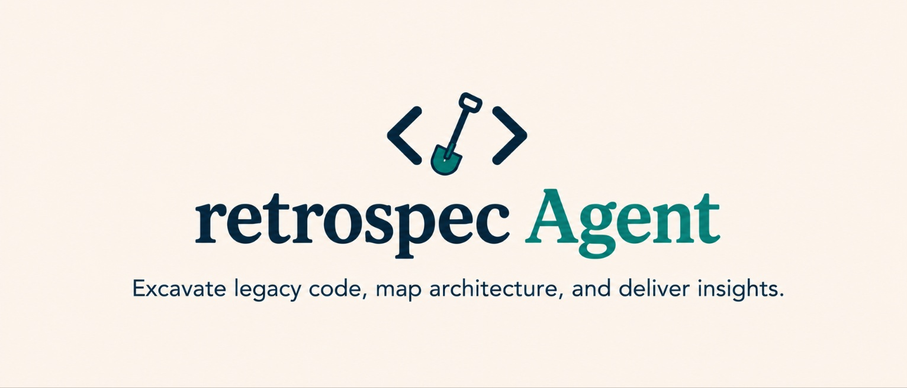
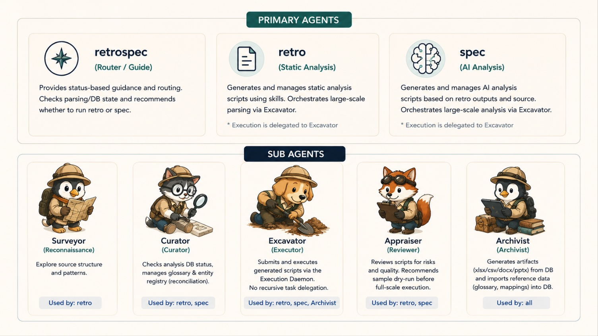
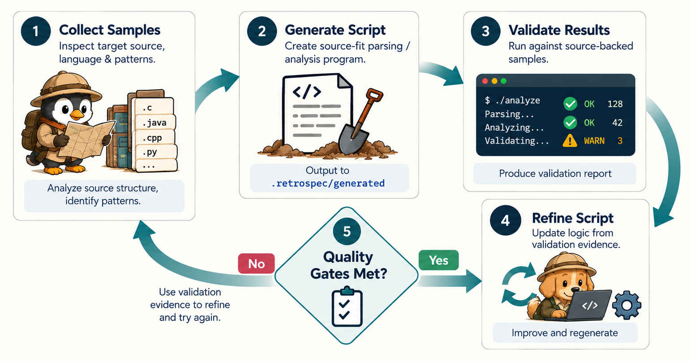
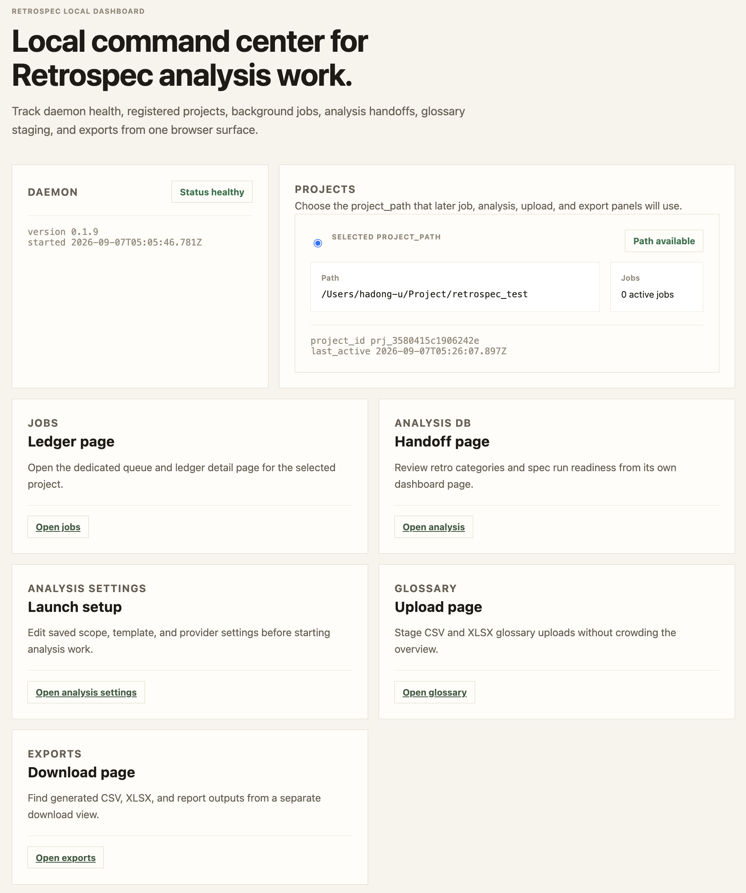
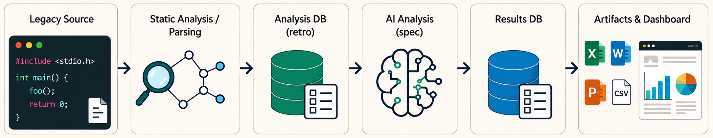

<p align="center">
  <a href="README.en.md"></a>
  <a href="README.md"></a>
</p>

<p align="center">
  
</p>

<p align="center">
  <strong>Excavate legacy code, map architecture, and deliver insights.</strong><br>
  Retrospec Agent는 오래된 코드베이스를 daemon 기반으로 분석하고, OpenCode agent가 안전하게 정적 분석·AI 분석·export 작업을 이어갈 수 있게 만드는 로컬 분석 툴킷입니다.
</p>

<p align="center">
  <a href="#빠른-시작"></a>
  
  
  
  
</p>

<p align="center">
  <a href="#무엇을-해주나">무엇을 해주나</a> ·
  <a href="#agent-구성">Agent 구성</a> ·
  <a href="#지원-언어와-분석-방식">지원 언어와 분석 방식</a> ·
  <a href="#빠른-시작">빠른 시작</a> ·
  <a href="#동작-방식">동작 방식</a> ·
  <a href="#결과-조회와-연동">결과 조회와 연동</a> ·
  <a href="#troubleshooting">Troubleshooting</a>
</p>

## 무엇을 해주나

Retrospec은 레거시 프로젝트를 한 번에 다 이해했다고 가장하지 않습니다. 먼저 daemon이 현재 프로젝트 상태를 잡고, agent가 그 상태를 확인한 뒤 필요한 분석 작업만 안전한 경로로 넘깁니다.

Retrospec의 핵심은 **daemon-first, evidence-first**입니다. agent가 소스를 직접 추측해 답하지 않고, 정적 분석 DB와 AI 분석 DB, glossary, graph export를 읽어 근거가 남는 형태로 작업합니다. 분석 범위가 기본 skill로 충분하지 않으면 사용자 요구사항을 인터뷰로 구체화한 뒤, 검증 루프를 통과한 source-fit 분석 스크립트만 daemon job으로 실행합니다.

현재 공개 버전은 **OpenCode workflow를 기준으로 동작**합니다. `agents/`, `skills/`, `.opencode/retrospec.jsonc`, daemon/status/dashboard 흐름은 OpenCode에서 Retrospec router와 하위 agent가 읽고 실행하는 구성을 전제로 합니다.

## Agent 구성

Retrospec은 하나의 agent가 모든 일을 직접 처리하지 않고, 역할을 나눠 안전하게 라우팅합니다. 아래 agent들이 검증 루프 이미지에 등장하는 주요 역할입니다.



| Agent | 역할 |
|---|---|
| `retrospec` | 상태 확인과 라우팅을 담당하는 primary router |
| `retro` | 정적 분석 작업 생성과 관리 |
| `spec` | retro 결과와 소스 기반 AI 분석 관리 |
| `Surveyor` | 소스 구조, 언어, 경로, 위험 신호 조사 |
| `Curator` | 분석 DB 상태, glossary, entity registry 확인 |
| `Excavator` | 승인된 generated job을 daemon에 제출하고 실행 |
| `Appraiser` | generated script, manifest, validation evidence 검토 |
| `Archivist` | CSV/XLSX export와 glossary import/reconciliation 담당 |

더 자세한 skill routing과 readiness contract는 [`skills/README.md`](skills/README.md)를 참고하세요.

## 지원 언어와 분석 방식

```text
현재 권장/지원: OpenCode + retrospec-agent
Runtime: Bun >= 1.3.0
```

분석 agent는 기본적으로 skill에 포함된 언어 규칙과 parser 전략을 사용합니다. Java, C, TypeScript 같은 우선 지원 언어는 가능한 한 AST/parser 기반으로 구조와 symbol을 추출하고, 그 외 언어나 불완전한 parser coverage는 `best-effort`/`unsupported`/`missing_capability` evidence로 표시합니다. 조용히 정확한 척하지 않고, coverage와 confidence를 daemon state와 dashboard/API에 남깁니다.

기본 규칙으로 분석하기 어려운 요청은 바로 거절하거나 임의 구현하지 않습니다. Retrospec은 사용자의 요구사항을 인터뷰를 통해 구체화하고, 다음 루프를 통해 분석 스크립트를 생성합니다.



이 루프는 다음 경계를 지킵니다.

- Surveyor가 대상 소스와 언어 특성을 먼저 확인
- custom-analysis-interview가 추출 대상, 조건, 성공 기준을 질문으로 좁힘
- source-fit generated analyzer가 manifest와 generation contract를 함께 생성
- validation report가 sandbox, dry-run, sample coverage, parser fallback을 검증
- Appraiser가 승인한 job만 Excavator가 daemon에 제출
- 실패나 축소 coverage는 `evidence_label`, `support_level`, `missing_capability`로 남김

## 주요 기능

- 프로젝트별 `.retrospec/` 상태 디렉터리 관리
- structure, symbols, SQL, call graph, dependency, data flow, complexity, security 후보 분석 handoff
- spec/risk/migration/summary 같은 AI 분석 실행 준비
- custom analysis interview와 generated script validation loop
- CSV/XLSX export, GraphML/Cypher/Mermaid graph export, glossary 업로드 staging
- dashboard에서 daemon health, 프로젝트, jobs, 분석 DB, exports 확인
- export dashboard에서 GraphML/Cypher/Mermaid preview 확인
- legacy MCP와 2026 stateless-style MCP client를 위한 read-only `/mcp` JSON-RPC surface
- generated analysis program을 바로 실행하지 않고 Appraiser 검토와 Excavator 제출 경로로 통제

Retrospec의 기본 원칙은 **status first, daemon first**입니다. agent는 먼저 daemon health와 `/analysis/status`를 확인하고, 그 결과를 바탕으로 다음 작업을 안내합니다.

## 빠른 시작

### 1. 설치

Retrospec은 OpenCode agent workflow와 Bun 런타임을 사용합니다.

```bash
npm install -g retrospec-agent
```

필요 조건:

```text
OpenCode
Bun >= 1.3.0
```

OpenCode agent에게 맡기는 경우에는 이렇게 요청해도 됩니다.

```text
이 프로젝트에 retrospec-agent 설치하고, 현재 프로젝트 기준으로 status와 dashboard까지 확인해줘.
```

설치·daemon 재시작·상태 확인을 OpenCode agent에게 맡길 때는 [`docs/agent-install.md`](docs/agent-install.md)를 함께 참고하게 하면 됩니다.

### 2. 분석할 프로젝트에서 상태 확인

```bash
cd /path/to/your/project
retrospec status .
```

직접 daemon을 먼저 띄우지 않아도 됩니다. `retrospec status .`는 사용할 daemon이 없거나 현재 버전과 맞지 않으면 daemon을 시작하려고 시도합니다. foreground에서 daemon을 유지하고 싶을 때만 `retrospec daemon`을 따로 실행하세요. 이미 오래된 daemon이 살아 있거나 다른 workspace를 잡고 있으면 아래 [버전 업데이트 시 유의사항](#버전-업데이트-시-유의사항)을 먼저 확인하세요.

#### 버전 업데이트 시 유의사항

npm package를 업데이트해도 이미 떠 있는 daemon 프로세스가 자동으로 교체되지는 않습니다. `retrospec status .`에서 예전 버전, 다른 프로젝트, 또는 존재하지 않는 포트가 보이면 기존 daemon을 종료하고 현재 프로젝트에서 다시 확인하세요.

```bash
ps aux | grep retrospec
kill <old-daemon-pid>

cd /path/to/your/project
retrospec status .
```

예상 출력은 이런 형태입니다.

```text
daemon: healthy (0.1.x)
dashboard: http://127.0.0.1:<port>/dashboard
project: /path/to/your/project
state: existing .retrospec
retro: sql=ready_for_analysis, structure=ready_for_analysis, symbols=ready_for_analysis
spec: summary=completed
next: Review retro status, then run spec for ready categories.
```

### 3. Dashboard 열기

`retrospec status .`가 출력한 dashboard URL을 브라우저에서 엽니다. Dashboard 화면은 daemon base URL이 아니라 `/dashboard` 경로입니다.

```text
http://127.0.0.1:<port>/dashboard
```



## 동작 방식



Retrospec은 legacy source를 바로 AI에게 넘기지 않고, 먼저 정적 분석으로 구조를 파싱해 `retro` 분석 DB를 만듭니다. 그다음 `spec` AI 분석이 이 DB와 소스 근거를 함께 읽어 결과 DB를 채우고, 마지막으로 dashboard, CSV/XLSX, graph export, MCP read tool 같은 산출물로 확인합니다.

간단히 보면 다음 흐름입니다.

```text
Legacy Source
→ Static Analysis / Parsing
→ Analysis DB (retro)
→ AI Analysis (spec)
→ Results DB
→ Dashboard / Exports / MCP read surface
```

## 결과 조회와 연동

Retrospec의 결과 조회와 연동 기능은 모두 daemon이 소유한 `.retrospec` state를 기준으로 동작합니다. MCP나 dashboard가 별도 cache/state를 만들지 않습니다.

### Dashboard와 export

Dashboard는 daemon health, 등록 프로젝트, job ledger, analysis status, provider settings, uploads, exports를 보여줍니다. Export는 기존 CSV/XLSX 외에 graph DB를 agent와 사람이 읽기 쉬운 포맷으로 꺼낼 수 있습니다.

| Export | 용도 |
|---|---|
| CSV/XLSX | structure/symbols 분석 결과를 표 형태로 공유 |
| GraphML | Gephi, yEd 같은 graph tool에서 call graph 확인 |
| Cypher | Neo4j류 graph DB import 초안으로 사용 |
| Mermaid | README/문서에서 sequence candidate를 빠르게 preview |

Dashboard export 화면은 GraphML/Cypher/Mermaid 파일을 내려받기 전에 가벼운 preview를 보여줍니다.

### MCP 지원

Retrospec daemon은 read-only `/mcp` JSON-RPC endpoint를 제공합니다.

기본 노출 tool은 두 개입니다.

| Tool | 역할 |
|---|---|
| `retrospec_status` | 프로젝트의 retro/spec readiness와 status 조회 |
| `retrospec_explore` | daemon state 기반 anchor 탐색 |

기본 tool 외 `retrospec_impact`, `retrospec_epics`, `retrospec_glossary_search`, `retrospec_sql_access`, `retrospec_export` 같은 확장 tool은 `RETROSPEC_MCP_TOOLS`로 opt-in할 수 있게 예약되어 있습니다.

MCP client 호환성은 두 흐름을 모두 고려합니다.

- 기존 stateful/session 중심 client: 일반 `tools/list`, `tools/call` JSON-RPC 요청 지원
- 2026 stateless-style client: `MCP-Protocol-Version`, `Mcp-Method`, `Mcp-Name`, `_meta`가 포함된 self-contained 요청 지원

`Mcp-Method`나 `Mcp-Name`이 JSON-RPC body와 어긋나면 JSON-RPC error로 거절합니다.

## 작업 흐름

```text
project source
→ retrospec daemon이 프로젝트와 상태 디렉터리 등록
→ retrospec router가 daemon health와 analysis status 확인
→ retro/spec/Archivist agent가 필요한 skill과 template 선택
→ 필요하면 custom-analysis-interview로 요구사항 구체화
→ generated program contract와 validation report 작성
→ Appraiser가 manifest와 evidence 검토
→ Excavator가 승인된 job만 daemon에 제출
→ .retrospec DB, jobs, exports, dashboard, MCP read surface에 결과 반영
```

주요 산출물은 프로젝트 내부 `.retrospec/` 아래에 저장됩니다.

| 영역 | 역할 |
|---|---|
| `.retrospec/registry.db` | 프로젝트, handoff, workflow 상태 |
| `.retrospec/retro/*.db` | structure, symbols, SQL, graph, risk 후보 등 정적 분석 DB |
| `.retrospec/spec/ai_analysis.db` | spec/risk/migration/summary AI 분석 결과 |
| `.retrospec/jobs/` | daemon job ledger와 snapshot |
| `.retrospec/generated/` | source-fit generated analysis program과 validation report |
| `.retrospec/exports/` | CSV/XLSX/report/GraphML/Cypher/Mermaid export 결과 |

## Daemon과 Dashboard

Retrospec daemon은 로컬 API/job 서버이고, dashboard는 그 daemon이 제공하는 브라우저 UI입니다. 보통 같은 로컬 서버 포트를 사용하지만, 오래된 daemon이 여러 개 떠 있으면 status가 다른 포트를 가리킬 수 있습니다.

`retrospec status .`는 daemon이 없거나 현재 CLI 버전과 맞지 않을 때 daemon 자동 시작을 시도합니다. 그래서 일반적인 첫 사용은 `retrospec status .`만으로도 시작할 수 있습니다.

업데이트 후에는 기존 daemon이 계속 살아 있을 수 있습니다. 새 버전을 설치한 뒤 `retrospec status .`에서 예전 버전이나 다른 프로젝트가 보이면 기존 daemon을 종료하고 현재 프로젝트에서 다시 확인하세요.

```bash
ps aux | grep retrospec
kill <PID>

cd /path/to/your/project
retrospec status .
```

## 포함된 패키지 구성

```text
retrospec-agent/
├── agents/
├── hooks/
├── prompts/
├── skills/
├── src/
├── templates/
├── .opencode/retrospec.jsonc
└── DESIGN.md
```

Public package에는 runtime/local/private 상태가 포함되지 않습니다.

- `.retrospec/` 제외
- `.giqo/` 제외
- `.omo/` 제외
- `source/` 제외
- local daemon token/port 파일 제외

## Troubleshooting

### `retrospec status .`가 다른 프로젝트를 보여줄 때

기존 daemon이 다른 workspace에서 떠 있는 상태일 수 있습니다.

```bash
ps aux | grep retrospec
kill <old-daemon-pid>
cd /path/to/current/project
retrospec daemon
retrospec status .
```

### 새 버전을 설치했는데 daemon version이 그대로일 때

npm package는 업데이트됐지만 daemon 프로세스는 자동으로 교체되지 않습니다. daemon을 재시작하세요.

```bash
npm list -g retrospec-agent --depth=0
ps aux | grep retrospec
kill <old-daemon-pid>
retrospec status .
```

OpenCode agent에게 맡기는 경우에는 다음처럼 요청하세요.

```text
OpenCode에서 retrospec-agent 설치 상태와 실행 중인 daemon 포트를 확인하고, 오래된 daemon이면 종료한 뒤 현재 프로젝트 기준으로 status와 dashboard URL을 확인해줘. docs/agent-install.md를 참고해줘.
```

### `retrospec --version`이 동작하지 않을 때

현재 CLI는 `--version` command surface를 제공하지 않을 수 있습니다. 설치 버전은 npm으로 확인하세요.

```bash
npm list -g retrospec-agent --depth=0
npm view retrospec-agent version
```

### Full test suite가 실패할 때

현재 공개 패키지는 release gate로 typecheck, lint, focused readiness test, npm pack dry-run을 사용합니다. 일부 legacy schema contract 테스트는 오래된 migration fixture와 최신 partial-scope schema 사이의 drift가 남아 있을 수 있습니다.

## 현재 범위

Retrospec은 현재 OpenCode에서 사용하는 agent/skill/daemon package를 중심으로 배포됩니다. 설치, routing, hook/config policy, job 제출 흐름은 OpenCode 기준으로 안내합니다.

다만 read-only MCP 표면은 별도로 제공합니다. MCP client가 기존 session 중심 요청을 사용하든 2026 stateless-style 요청을 사용하든, `retrospec_status`와 `retrospec_explore` 같은 읽기 tool은 daemon state를 통해 동작하도록 맞춰져 있습니다. 쓰기 작업과 generated analysis 실행은 여전히 Retrospec agent gate와 daemon job 검증 흐름을 통과해야 합니다.

Retrospec은 아직 모든 분석을 고정된 built-in analyzer로 처리하지 않습니다. static-analysis skill은 프로젝트 survey와 reference fixture를 바탕으로 source-fit generated program을 만들고, validation report와 Appraiser review를 거친 뒤 daemon job으로 제출하는 흐름을 따릅니다.

Router agent는 직접 분석하거나 DB를 임의로 쓰지 않습니다. 분석 실행은 retro, spec, Archivist, Appraiser, Excavator 역할 경계를 통해 진행됩니다.
